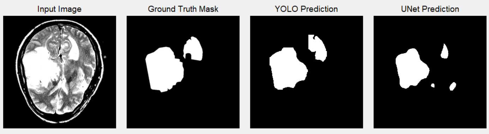

# Brain Tumor Segmentation
The main focus of this project is to explore the implementation of [ClearML](https://clear.ml) (ML versioning tool) into segmentation projects.

Simple brain tumor segmentation using [YOLOv11](https://github.com/ultralytics/ultralytics) and [UNet (PyTorch)](https://pytorch.org) architectures.

Used [Brain Tumor](https://universe.roboflow.com/instant-8qfjt/brain-tumor-yzzav-gfuc5) dataset from Roboflow.

Ran on Nvidia 4080 GPU. Also works for CPU.

---

## Contents
- [Git Structure](#git-structure)
- [Model Results](#model-results)
- [What is ClearML](#what-is-clearml)
- [ClearML + YOLO](#clearml-yolo)
- [ClearML + PyTorch](#clearml-pytorch)
- [Conclusions](#conclusions)

## Git Structure
The repository contains the following important scripts and directories:

- **view_results folder**: Contains images and masks used for visualizing the model results. Used by `view_results.py` script.
- **txt_to_mask.py**: Converts YOLO text annotations into binary PNG masks for use with UNet.
- **unet_model.py**: Contains the UNet architecture (code removed for privacy purposes).
- **unet_train.py**: Script for training the UNet model.
- **view_results.py**: Runs the models to predict masks for images and visualizes results side by side using Tkinter.
- **yolo_train.py**: Training script for YOLO.

## Model Results

From the experiments, YOLO performed better overall in segmentation tasks compared to UNet.

## What is ClearML
[ClearML](https://clear.ml) is a machine learning operations (MLOps) platform that provides tools for experiment tracking, dataset versioning, and model management. It helps manage machine learning workflows by automatically logging scripts, package dependencies, and training results, making reproducibility and collaboration easier.

## ClearML YOLO
ClearML integrates seamlessly with YOLO. The results, including trained models, are automatically saved on ClearML, making it easy to download models directly from the experiment logs instead of searching through YOLO folders. 

More details on integration can be found here: [Ultralytics ClearML Integration](https://docs.ultralytics.com/integrations/clearml/).

## ClearML PyTorch
The integration of ClearML with PyTorch is still under exploration. Similar to YOLO, we can save the dataset used for training the UNet model in the ClearML app. However, logging results, graphs, and models is more complex.

More details on PyTorch integration can be found here: [ClearML PyTorch Integration](https://clear.ml/docs/latest/docs/integrations/pytorch).

## Conclusions
ClearML is very simple to implement in YOLO scripts but requires more effort for PyTorch scripts. It is a highly useful tool because, for each ML experiment, it logs:

- The code that was executed
- The package dependencies and versions
- The trained models
- Results and performance graphs

Additionally, it enables easy comparison between different runs, such as evaluating a YOLO model trained with Adam versus another trained with SGD.

## TODO
- Save UNet logs (ClearML automatically saves the GPU performance and info but nothing related to training)
- Save trained UNet model in ClearML (currently just saves the path of the model)
- Use Optuna to create various model configs to compare in ClearML
